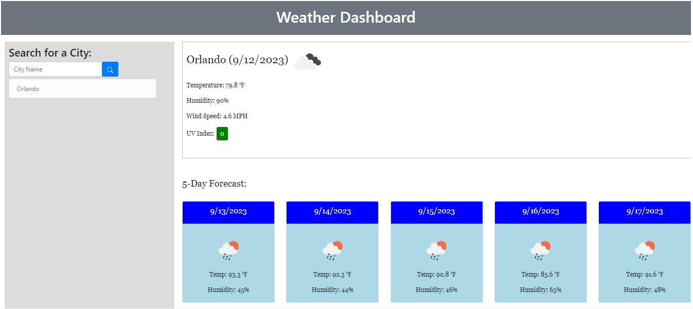

# 5 Day Weather Forecast

## Description
This challenge involved creating a 5 day weather forecast for cities. The user can enter a name and it will search for and match the closest city with that name. If it cannot find the city, it will alert the user. It will store the city in a list on the left side and as the user searches for more cities, they will be added to the list.

## Screenshot

## Live Application
https://usflfelipe.github.io/weather-dashboard/